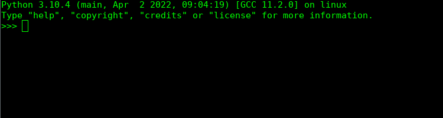

# Országgyűlési Napló elemző
## Leírás:  
A csomag az Országgyűlési Napló pdf dokumentum letöltésére és elemzésére szolgál.
## A modullal lehetséges:
   1. az aktuális pdf dokumentum letöltése  
   2. pdf formátumból txt formátumba való átalakítása  
   3. a dokumentum tisztázása  
   4. a következő adatok kinyerése:
   
   * parlementi ciklus  
   * dokumentum szám
   * elnökök listája
   * jegyzők listája
   * törzsszöveg
   * felszólaló képviselők listája
   * tárgyalt határozati javaslatok listája
   * tárgyalt törvényjavaslatok listája
   * képviselői felszőlalások listája
   * felszólalás közben elhangzó és legyzett reakciók listája

Országgyűlési napló dokumentum forrása: https://www.parlament.hu/web/guest/orszaggyulesi-naplo

### 1. Modul importálása


```python
from pathlib import Path
from pprint import pprint

import hunparl as hp

HOME_DIR = Path("/home/Downloaded")
```

### 2. Letöltés
#### 2.a A parlament.hu oldalán legutoljára közzétett Országgyűlési napló letöltése (default) a megadott DOWN_DIR elérési útvonalra
forrás: https://www.parlament.hu/web/guest/orszaggyulesi-naplo




```python
hp.letolto.scraper(DOWN_DIR)
```

    Országgyűlési Napló 17.szám.pdf mentve: /home/xn/Downloads/Országgyűlés  


#### 2.b Tetszőleges szám letöltése


```python
szam = "5"
hp.letolto.scraper(DOWN_DIR,szam)
```

    Országgyűlési Napló 5.szám.pdf mentve: /home/xn/Downloads/Országgyűlés


### 3. PDF formátumból TXT formátumba történő konvertálás


```python
konvertalt = hp.konvertalo.pdf_to_txt(DOWN_DIR/"Országgyűlési Napló 17.szám.pdf")
```

```python
konvertalt[:100]
```

    '   2022-2026. országgyűlési ciklus   Budapest, 2022. június 27. hétfő \n\n17. szám \n\n \n\n \n \n \n \n\n \n\nOr'


### 4. Az átalakított dokumentum tisztázása

A dokumentum szövegéből eltávolítja:

1.  a sorvégi szóelvalasztáshoz használt "-" kötőjeleket  
2. időjelöléseket 
3. oldalszámokat  
4. oldal fejlecéket

```
tisztazott = hp.tisztazo.ogy_n_tisztazo(konvertalt)
```

### 5. Adatok kinyerése a tisztázott dokumentumból

#### 5.a Ciklus


```python
hp.parser.ciklus(tisztazott)
```
    '2022-2026'


#### 5.b Aktuális kiadvány száma


```python
hp.parser.szam(tisztazott)
```
    '17'

#### 5.c Parlamenti ülés dátuma

```python
hp.parser.ules_datum(tisztazott)
```


    '2022. június 27.'

#### 5.d Elnökök
(alelnökök és a háznagy)  
A Házbizottság az Országgyűlés döntés-előkészítő testülete,  
melynek elnöke az Országgyűlés elnöke, tagjai az Országgyűlés alelnökei,  
a képviselőcsoportok (frakciók) vezetői és a háznagy.  


```python
hp.parser.elnok_lista(tisztazott)
```

    ['Kövér László, Jakab István', 'dr. Oláh Lajos']

#### 5.e Jegyzők

```python
hp.parser.jegyzo_lista(tisztazott)
```
    ['Hiszékeny Dezső', 'Szabó Sándor', 'dr. Szűcs Lajos', 'dr. Vinnai Győző']
    

#### 5.f Törzsszöveg
> "ELNÖK: (A teremben lévők felállnak, [...] az ülést bezárom." közötti rész.  
> Nem tartalmazza:
* fedlap, 
* a tartalomjegyzék, 
* az ülésen jelen voltak listája, 
* a jegyzői aláírások
* impresszum


```python
torzsszoveg = hp.parser.torzs_szoveg(tisztazott)
print(torzsszoveg[:100])
```

    ELNÖK: (A teremben lévők felállnak, és ezzel köszöntik a választópolgárok közösségét. Amikor az  ülé


#### 5.g Felszólaló képviselők listája
> Különbözhet az ülésen jelenlévők listájától


```python
kepv_list = hp.parser.kepviselo_lista(torzsszoveg)
kepv_list
```

    ['BAKOS BERNADETT',  
    'BALASSA PÉTER',  
    'BARKÓCZI BALÁZS',  
    'BENCZE JÁNOS',  
    'BERKI SÁNDOR',  
    'DR. APÁTI ISTVÁN',  
    'DR. BRENNER KOLOMAN',  
    'DR. FÓNAGY JÁNOS',  
    'DR. FÜRJES BALÁZS',  
    'DR. HARANGOZÓ TAMÁS',  
    'DR. KERESZTES LÁSZLÓ LÓRÁNT',  
    'DR. KONCZ ZSÓFIA',  
    'DR. KÁLLAI MÁRIA',  
    'DR. LUKÁCS LÁSZLÓ GYÖRGY',  
    'DR. MELLÁR TAMÁS',  
    'DR. RÉPÁSSY RÓBERT',  
    'DR. SIMICSKÓ ISTVÁN',  
    'DR. VARGA JUDIT',  
    'DÓCS DÁVID',  
    'DÖMÖTÖR CSABA',  
    'DÚRÓ DÓRA',  
    'FARKAS SÁNDOR',  
    'FEKETE-GYŐR ANDRÁS',  
    'FÖLDESI GYULA',  
    'FÖLDI LÁSZLÓ',  
    'GY. NÉMETH ERZSÉBET',  
    'HALÁSZ JÁNOS',  
    'HEGEDÜS ANDREA',  
    'HISZÉKENY DEZSŐ',  
    'JAKAB PÉTER',  
    'KANÁSZ-NAGY MÁTÉ',  
    'KOMJÁTHI IMRE',  
    'KÁLMÁN OLGA',  
    'MAGYAR LEVENTE',  
    'MENCZER TAMÁS',  
    'MIHÁLFFY BÉLA',  
    'MINDEN JOG FENNTARTVA',  
    'NACSA LŐRINC',  
    'NÉMETH SZILÁRD ISTVÁN',  
    'ORBÁN VIKTOR',  
    'OROSZ ANNA',  
    'RÉTVÁRI BENCE',  
    'SEBIÁN-PETROVSZKI LÁSZLÓ',  
    'SZABÓ REBEKA',  
    'SZABÓ SÁNDOR',  
    'TOMPOS MÁRTON KRISTÓF',  
    'TORDAI BENCE',  
    'TOROCZKAI LÁSZLÓ',  
    'TUZSON BENCE',  
    'TÁLLAI ANDRÁS',  
    'TÓTH ENDRE',  
    'UNGÁR PÉTER',  
    'VAJDA ZOLTÁN',  
    'VARGA ZOLTÁN',  
    'VARJU LÁSZLÓ',  
    'VITÁLYOS ESZTER',  
    'Z. KÁRPÁT DÁNIEL']


#### 5.h Tárgyalt határozati javaslatok listája

```python
hp.parser.hatarozati_javaslat_lista(torzsszoveg)
```
A példa másik egy példányból származik:  

    ['H/7380', 
    'H/7840', 
    'H/7960', 
    'H/8191']

#### 5.i Tárgyalt vagy említett törvényjavaslatok listája

```python
hp.parser.torveny_javaslat_lista(torzsszoveg)
```

    ['T/286', 
    'T/287']

#### 5.j Képviselői felszőlalások szótára
> Kulcs: képviselő neve  
> Érték: felszólalás(ok) listája  
> Mivel a kulcs gyakran lista értéket tartalmaz, abba indexelésekkel tudunk belépni.  
> Ha egy képviselő csak egyszer szólal fel, akkor nem kell indexelést használni.  

```python
kepv_felsz_dict = hp.parser.kepviseloi_felszolalas_szotar(torzsszoveg,kepv_list)
print("Kulcsok:")
pprint(kepv_felsz_dict.keys())
```

    Kulcsok:
    dict_keys(['BAKOS BERNADETT', 'BALASSA PÉTER', 'BARKÓCZI BALÁZS', 'BENCZE JÁNOS', 'BERKI SÁNDOR', 'DR. APÁTI ISTVÁN', 'DR. BRENNER KOLOMAN', 'DR. FÓNAGY JÁNOS', 'DR. FÜRJES BALÁZS', 'DR. HARANGOZÓ TAMÁS', 'DR. KERESZTES LÁSZLÓ LÓRÁNT', 'DR. KONCZ ZSÓFIA', 'DR. KÁLLAI MÁRIA', 'DR. LUKÁCS LÁSZLÓ GYÖRGY', 'DR. MELLÁR TAMÁS', 'DR. RÉPÁSSY RÓBERT', 'DR. SIMICSKÓ ISTVÁN', 'DR. VARGA JUDIT', 'DÓCS DÁVID', 'DÖMÖTÖR CSABA', 'DÚRÓ DÓRA', 'FARKAS SÁNDOR', 'FEKETE-GYŐR ANDRÁS', 'FÖLDESI GYULA', 'FÖLDI LÁSZLÓ', 'GY. NÉMETH ERZSÉBET', 'HALÁSZ JÁNOS', 'HEGEDÜS ANDREA', 'HISZÉKENY DEZSŐ', 'JAKAB PÉTER', 'KANÁSZ-NAGY MÁTÉ', 'KOMJÁTHI IMRE', 'KÁLMÁN OLGA', 'MAGYAR LEVENTE', 'MENCZER TAMÁS', 'MIHÁLFFY BÉLA', 'MINDEN JOG FENNTARTVA', 'NACSA LŐRINC', 'NÉMETH SZILÁRD ISTVÁN', 'ORBÁN VIKTOR', 'OROSZ ANNA', 'RÉTVÁRI BENCE', 'SEBIÁN-PETROVSZKI LÁSZLÓ', 'SZABÓ REBEKA', 'SZABÓ SÁNDOR', 'TOMPOS MÁRTON KRISTÓF', 'TORDAI BENCE', 'TOROCZKAI LÁSZLÓ', 'TUZSON BENCE', 'TÁLLAI ANDRÁS', 'TÓTH ENDRE', 'UNGÁR PÉTER', 'VAJDA ZOLTÁN', 'VARGA ZOLTÁN', 'VARJU LÁSZLÓ', 'VITÁLYOS ESZTER', 'Z. KÁRPÁT DÁNIEL'])

```python
kepv_felsz_dict['OROSZ ANNA']
```
    '['OROSZ ANNA (Momentum): Köszönöm a szót.  Tisztelt Államtitkár Asszony! Palkovics László innovációs  és technológiai miniszterként még az előző ciklusban  többször is hangsúlyozta a...'

#### 5.k Felszólalás közben elhangzó és lejegyzett reakciók listája
Ha egy kéviselőtől több felszuólalást is tartalmaz a kepv_felsz_dict,   
akkor bele kell indexelni a listába: kepv_felsz_dict['OROSZ ANNA'][0]  

```python
hp.parser.reakcio_lista(kepv_felsz_dict['OROSZ ANNA'][0])
```

    ['(Momentum)', '(Rétvári Bence: Vagy képviselőt!)',   
    '(Az elnök a csengő megkocogtatásával jelzi az időkeret leteltét.)',   
    '(Az elnök ismét csenget.)']  
